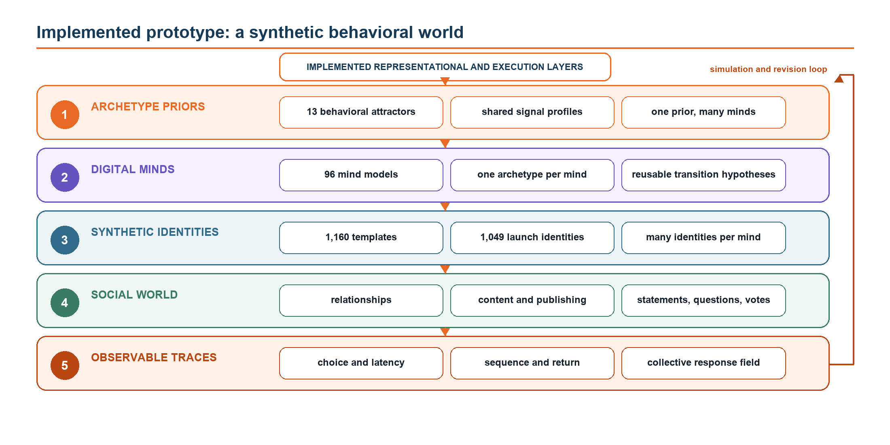
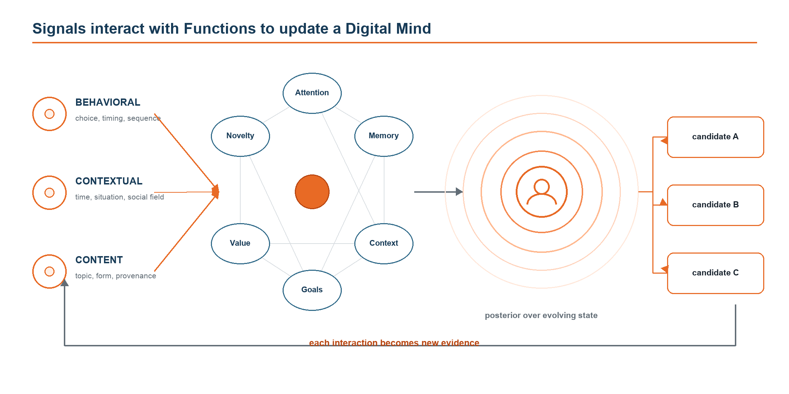
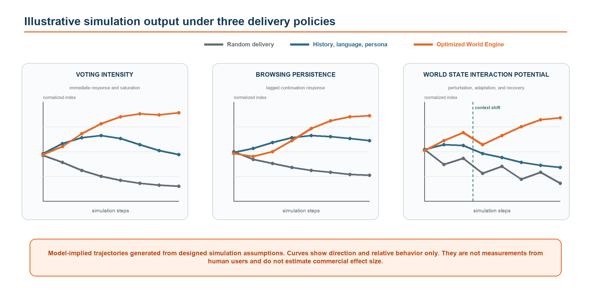

# The World Engine

[](https://doi.org/10.5281/zenodo.21932401)
[](paper/the-world-engine.pdf)
[](#current-status)
[](https://www.voopa.app/waitlist)

**A computational framework for predictive discovery and latent behavioral dynamics.**

The World Engine is a research program for discovery systems that represent behavior as the observable output of an evolving, partially observed process. It asks whether shared behavioral dynamics, current signals, explicit state transitions, and relational context can improve prediction when long individual histories are unavailable, stale, or misleading.

The framework is intended for environments that decide which information appears next, including social feeds, streaming services, digital commerce, programmatic advertising, and conversational discovery. Its first experimental setting is a social application organized around visual statements and questions, bounded response options, voting, and short-lived conversations.

[Read the paper](https://doi.org/10.5281/zenodo.21932401) · [Research page](https://www.voopacorp.com/research) · [Explore Voopa](https://www.voopa.app/) · [Join the waitlist](https://www.voopa.app/waitlist)

## From research to product

Voopa is the first planned consumer setting for testing ideas developed through the World Engine research program. The application is organized around visual statements and questions, bounded voting options, short-lived conversations, and real-time discovery. This structure can support controlled comparisons among conventional delivery, randomized delivery, and state-aware discovery policies.

The current public application and synthetic-world prototype should not be interpreted as evidence that the World Engine improves human engagement or user outcomes. Those claims require prospective testing with real participants. People interested in taking part in early product testing can [explore Voopa](https://www.voopa.app/) and [join the early-access waitlist](https://www.voopa.app/waitlist).



## Research hypothesis

Modern discovery systems learn powerful representations from content, language, interaction sequences, and population behavior. The World Engine does not assume that these systems are simple or ineffective. It proposes a more structured hypothesis: prediction may improve under cold start, context change, preference shift, and novel discovery when the system maintains uncertainty over several possible transition models instead of treating an observed trace as a sufficient description of the user.

At decision time, a candidate is evaluated by the state transitions it may produce under the current posterior, not only by similarity to prior consumption. The resulting objective can include immediate relevance, delayed satisfaction, information gain, diversity, user control, creator exposure, and explicit risk penalties.

## Computational primitives

| Primitive | Computational role |
| --- | --- |
| **Signal Intelligence** | Detects multivariate predictive structure in the event field, including response order, relative behavior, temporal structure, collective dynamics, context, and change. |
| **Archetype** | A shared prior over platform-relevant transition dynamics. It is not a demographic profile or topic persona. |
| **Digital Mind** | A reusable transition hypothesis containing state, transition, emission, retrieval, and uncertainty models. |
| **Identity** | A real or synthetic actor associated with observations and posterior weights over Digital Minds. |
| **Function** | A reusable state-transition operator, such as novelty response, memory retrieval, value estimation, goal activation, or context gating. |
| **World State** | The evolving population, content, relationships, shared context, and policy through which individual actions influence future observations. |



## Current status

The August 2026 prototype implements the principal representational and execution layers as a synthetic behavioral world:

- 13 registered Archetype priors
- 96 active Digital Minds
- 1,160 synthetic identity templates
- 1,049 mind-linked launch identities
- content acquisition, routing, identity expression, publishing, relationships, and observable interaction traces

These are counts of software objects, not experimental sample sizes. Archetypes, Digital Minds, routing rules, and much of synthetic behavior currently contain designed assumptions. The prototype demonstrates that the ontology can operate as an executable environment. It does not establish that the model predicts human latent state or improves human outcomes.

See [Implementation status](docs/implementation-status.md) for the boundary between implemented, simulated, and proposed components.

## Falsifiable evaluation

The primary scientific question is whether explicit transition structure adds predictive value beyond strong sequence, representation-learning, collaborative, state-space, and model-based recommendation baselines.

The proposed program tests:

1. **Reduced history dependence:** cold-start and history-masking experiments measure calibration, regret, and adaptation speed.
2. **Signal value beyond semantics:** exposure-corrected and randomized tests ask whether behavioral structure predicts future action after controlling for content and language.
3. **Adaptation to change:** controlled context, goal, and preference shifts measure detection delay and predictive loss.
4. **Prospective discovery:** low-similarity candidates test delayed relevance, satisfaction, regret, and confidently wrong recommendations.
5. **Ecosystem effects:** creator exposure, concentration, minority signals, and relational feedback test whether local optimization degrades the broader World State.

A generic sequence or state-space model should be preferred if it matches or exceeds the structured model under capacity-matched evaluation. See the [evaluation framework](docs/evaluation-framework.md).



The trajectories above are generated from designed simulation assumptions. They show directional behavior inside the synthetic world and are not measurements from human users or estimates of commercial effect.

## Reference scaffold

[`reference/world_engine_scaffold.py`](reference/world_engine_scaffold.py) is a small, dependency-free illustration of the paper's interfaces. It demonstrates candidate-conditioned state transition, uncertainty-aware trajectory scoring, and multi-objective ranking. It is not the Voopa production system, a trained model, or evidence of empirical performance.

This repository intentionally excludes private application code, user data, learned parameters, deployment infrastructure, and production mapping logic.

## Repository structure

```text
paper/       Canonical research paper
figures/     Scientific figures reproduced from the paper
docs/        Implementation boundary, evaluation design, and terminology
reference/   Non-production computational scaffold
```

## Citation

Please cite the archival Zenodo version:

> Voopa Corp. (2026). *The World Engine: A New Computational Framework for Predictive Discovery and Latent Behavioral Dynamics* (Version 1.0). Zenodo. https://doi.org/10.5281/zenodo.21932401

Machine-readable citation metadata is provided in [`CITATION.cff`](CITATION.cff).

## License and intellectual property

The paper, documentation, and figures are available under the Creative Commons Attribution 4.0 International license. The illustrative reference code is published for inspection but is not an open-source release of the production system. See [`LICENSE.md`](LICENSE.md) for the exact scope.

© 2026 Voopa Corp.
