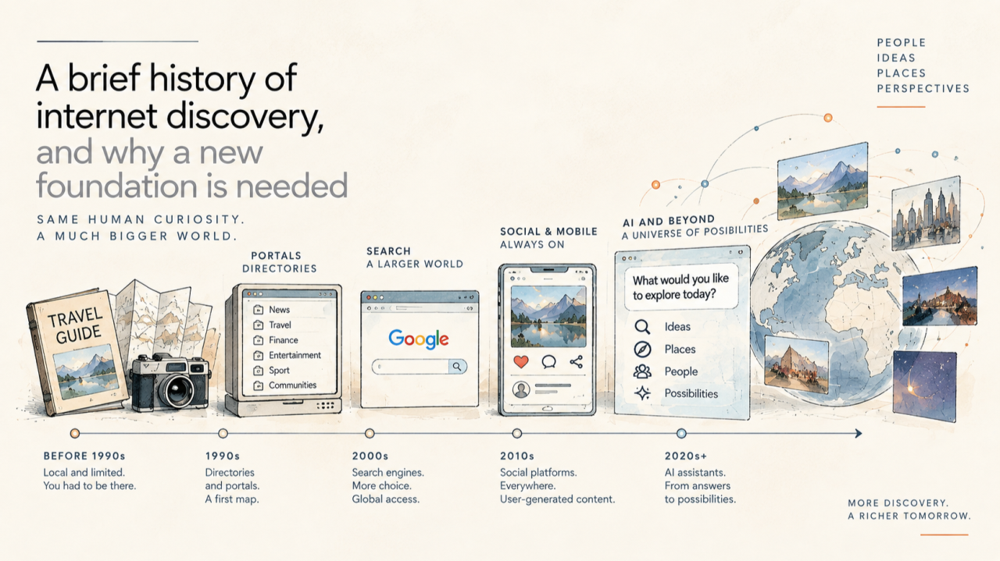
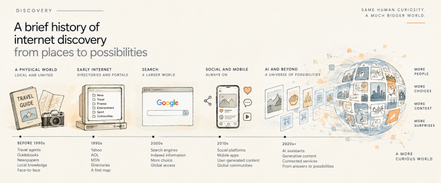
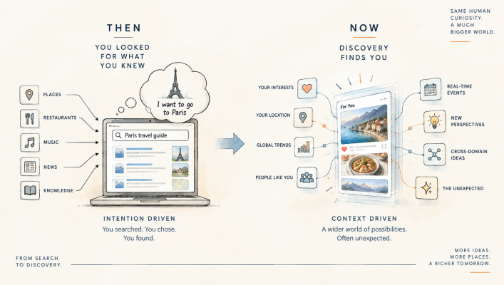
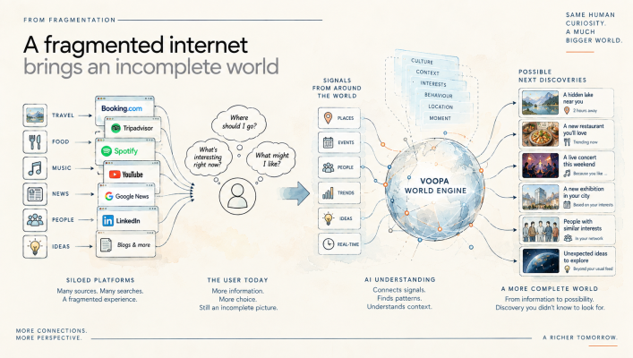

# A brief history of internet discovery, and why it may need a new foundation

*Same human curiosity. A much bigger world.*

The internet has reinvented itself many times in little more than three decades. We moved from portals to search engines, from websites to mobile applications, from static pages to social feeds, from broadcast media to streaming, and now from conventional software interfaces towards conversational AI and increasingly autonomous agents. Each transition has felt substantial because the visible experience of using technology changed with it.

Artificial intelligence is accelerating that process at a remarkable pace. Search is already being challenged by conversational interfaces. Tasks that once required several applications can increasingly be completed through one natural-language interaction. AI systems can read, write, analyse images, generate video, use software and coordinate increasingly complex workflows. It is reasonable to imagine that the application-centric internet itself may eventually become less visible, replaced by an intelligent layer that retrieves information and accesses services on our behalf.

Yet something curious has happened underneath all of this innovation. The surface of the internet has changed repeatedly, while many of the basic assumptions behind information discovery remain surprisingly close to those that emerged during its first decades. We still rely heavily on language to describe information, on search to express intention, on history to infer future interest, and on profiles or personas to represent users. These mechanisms have become dramatically more sophisticated, but their intellectual foundation remains familiar: observe what someone has asked for or done before, build a representation of that person, and use it to estimate what should come next.

There was a very good reason for building the internet this way. It reflected how discovery worked in the world at the time. The more interesting question in 2026 is whether the world, and the people moving through it, have changed faster than the discovery architecture built to serve them.

## The internet was built for a world of destinations

To understand why search, history and profiles became so fundamental, it helps to remember what discovering information looked like before the internet. Consider five ordinary parts of life: travel, food and leisure, media, communication, and friends or communities. In each case, discovery was shaped by physical access and by relatively well-defined destinations.

Planning a trip meant visiting a travel agency, reading a guidebook, going to a library or talking to somebody who had already been there. The available universe was largely determined by the information and products those intermediaries could provide. Food worked in much the same way. A new restaurant was discovered through friends, local knowledge, a newspaper review, a Michelin or Gault & Millau guide, or simply by walking past it. Media discovery depended on what radio stations played, what television channels scheduled, what newspapers covered and what record stores stocked. Communication required an address or a telephone number. New friendships and communities generally emerged from physical environments such as work, school, neighbourhoods, sports clubs, bars, associations and other places where people happened to meet.

The important limitation was not simply that less information existed. The journey itself was highly structured. In most cases you began with a purpose, selected the appropriate destination, and then explored within it. If you wanted travel information, you went somewhere associated with travel. If you wanted news, you opened a newspaper or watched a news programme. The category came before the discovery.

The early internet naturally inherited this structure. The portals of the 1990s were digital representations of a world organised into destinations. Yahoo, AOL, MSN and countless national portals presented news, sport, finance, entertainment, travel, weather and communities as distinct entrances into an otherwise unfamiliar digital environment. For millions of people encountering the web for the first time, this was intuitive because it resembled the way information was already organised offline. The internet initially made existing journeys more convenient rather than fundamentally changing them.

Search was the first major break from this architecture. A blank page with a search box looks completely natural today, but it required a different relationship with information. A portal offered a map. A search engine asked the user to formulate an intention. As the web grew, that became increasingly useful: the digital universe was simply becoming too large for directories and curated categories. Google and other search engines provided an elegant solution—rather than organising the entire web in advance, let people describe what they wanted and retrieve the most relevant information dynamically.

The physical world was expanding at the same time. Low-cost airlines opened destinations that had previously seemed expensive or impractical. Mobile phones made communication increasingly continuous. Globalisation expanded the variety of products, cultures and experiences available to ordinary consumers. Cable and satellite multiplied media choice. The web amplified all of this by making an increasingly large part of the world searchable.

Across travel, food, media, communication and community, the digital discovery universe began to grow far faster than its physical equivalent. Booking platforms exposed thousands of destinations. Restaurant databases transformed local recommendations into searchable inventories. Streaming removed the limits of broadcasting schedules. Social networks allowed people to find communities independent of geography. E-commerce made enormous product catalogues accessible from almost anywhere.

But for a long time the underlying intellectual journey remained surprisingly similar. You might walk into a travel agency or search for flights online, consult a restaurant guide or open a review platform, visit a record store or search for an artist on Spotify. Digital technology radically increased breadth and convenience, but the sequence was still largely intentional: first you knew what sort of thing you wanted, then you went looking for it.

*Figure 1. The expanding universe of discovery. From physical destinations and local knowledge to portals, search, social platforms and AI, the breadth of available information has expanded dramatically. The tools changed, but human curiosity remained.*

## Discovery became ambient, but the architecture remained historical

A person opening TikTok today may have no idea what they want to see. Someone browsing YouTube Shorts can move from a joke to a political argument, then to a restaurant, a scientific explanation, a football clip and a travel destination within minutes. Instagram can become a hotel guide. TikTok can become a restaurant search engine. Reddit can become technical support. An AI assistant can compare products, explain a medical term, plan a trip and summarise a document within the same conversation.

The old boundaries between information categories have become porous because discovery no longer always begins with a predefined objective. The early internet was somewhere people went to perform an activity. Increasingly, parts of the modern internet are environments people enter precisely because they do not yet know what they want to encounter.

The architecture underneath these experiences has become far more sophisticated. Modern recommendation systems use multimodal representations, graphs, sequences, learned embeddings, population behaviour, context and increasingly powerful machine-learning models. It would be wrong to describe them as simple keyword engines. What remains important, however, is the direction of inference: much of digital personalisation still begins with observable traces of previous behaviour. A system knows what somebody searched for, watched, clicked, bought, skipped or followed, then builds a representation from those observations and estimates what is likely to work next.

This works extraordinarily well when the future resembles the past. It becomes more complicated when the relevant variable is change. Imagine someone searching repeatedly for flights to Barcelona. A conventional system can infer strong travel intent and reasonably surface hotels, rental cars, luggage, insurance or additional flight offers. But suppose the flight has already been booked. The user is staying with friends, dislikes rental cars and intends to use public transport. The strongest historical signals may now describe a task that has already been completed.

Something else could suddenly matter much more. Perhaps FC Barcelona is playing while the person is there. The traveller may never have searched for football, followed the club or watched sports content online. Yet in the context of that particular journey, the match could become one of the most interesting discoveries of the trip.

History did not become useless. Its meaning changed. Someone may listen obsessively to one artist for a week, but that does not necessarily mean the artist should define their musical profile for the next six months. Someone can watch several videos about a health concern that subsequently disappears, buy a product and then continue receiving advertisements for precisely the thing they no longer need, or watch fifteen cat videos because they were amusing at midnight only to find the sixteenth irritating the following morning.

A historical system sees continuity. Human beings experience transitions.

*Figure 2. From intention-driven search to context-driven discovery. Early digital discovery largely began with explicit intent: the user knew what to look for and the system retrieved it. As discovery becomes increasingly contextual, relevance can also arise from location, timing, people, trends and unexpected connections.*

This distinction is obvious in the physical world because real-life discovery is constantly modified by context. You leave home intending to go somewhere and notice a restaurant you did not know existed. You hear music from a venue and change direction. Someone sends a message and your evening changes. The weather alters your plans. A conversation makes you interested in a subject you had never considered an hour earlier. Your attention, objectives, environment and internal state continuously interact with what is around you.

We rarely describe this as a recommendation system, but it is an extraordinarily rich discovery environment. The discrepancy between this fluid physical experience and the historical logic of digital discovery is becoming more important as AI begins to reshape the interface itself. We currently think of the internet largely through applications: an app for messaging, an app for transport, an app for maps, several for social media, several for travel, another for music and another for shopping. The super-app tried to solve this fragmentation by gathering multiple services within a single application.

AI may ultimately take us somewhere more radical. The future could be closer to an intelligent operating layer in which the underlying services become increasingly invisible. The system understands what the user is trying to accomplish, accesses whatever databases, platforms and applications are required, and presents the result without forcing the person to think about which digital destination to visit.

In that world, the distinction between search and discovery becomes even more consequential. If intelligence becomes the interface, it is not enough for the system to become exceptionally good at answering requests. It also needs to decide what information deserves to be surfaced before a request has been fully formulated. The question is no longer only whether the system knows what you liked. It is whether it can model how relevance changes when you went looking for it.

## Why we believe a different discovery architecture is worth testing

This is the problem we are exploring at Voopa, and it is the reason we built the World Engine. Our argument is not that search, language or history should disappear. They remain exceptionally valuable sources of information. Nor do we believe that modern recommendation systems are primitive. They are among the most sophisticated machine-learning systems deployed at scale. The question we are asking is narrower and, we think, more interesting: can a discovery system become less dependent on a long individual history by explicitly modelling the dynamics through which behaviour changes?

A conventional profile tends to accumulate evidence about a person. The longer the history, the richer the representation can become. Our approach instead tries to separate variables that should not necessarily evolve at the same speed. A relatively stable behavioural tendency should not be overwritten because of one unusual evening, while a temporary objective should not be diluted inside several years of historical behaviour. Context may change within minutes. Attention can move within seconds. A goal can disappear once it is completed.

The World Engine therefore treats behaviour as the observable result of an evolving and only partially observed process. Within the framework, Archetypes represent shared priors over behavioural transition dynamics. They are not demographic segments or marketing personas. Under those Archetypes sit Digital Minds: computational hypotheses about how a state may change when different Signals and contexts are introduced. They are not synthetic personalities and they are not claims to reproduce a biological brain.

*Figure 3. From Signals to possible discovery. The World Engine combines Signals, shared behavioural priors and alternative Digital Mind transition models to evaluate what may become relevant next, rather than relying only on a fixed historical profile.*

Our current synthetic-world prototype contains 13 Archetype priors and 96 active Digital Minds. Those Minds can be expressed through many different synthetic identities, allowing the same underlying behavioural structure to operate through different locations, interests, social contexts and outward identities. This separates how somebody appears from the transition dynamics the model is trying to understand.

Signal Intelligence provides the other side of the architecture. A Signal is not simply a keyword or something that is trending. It can be a reproducible pattern in behaviour, sequence, timing, context, response or collective activity that carries predictive information about what may happen next. Frequency alone is not enough. A rare pattern can be highly informative, while an extremely popular item may tell us very little about the state of a particular Digital Mind.

Instead of only asking whether a candidate piece of information resembles what somebody consumed before, the system can ask how that candidate might interact with the current state under several plausible behavioural models. That distinction is at the heart of predictive discovery.

The consumer Voopa application is one experimental environment. Its format is deliberately simple: a user encounters a visual statement or question with a bounded set of possible responses. The person can vote, pause, skip, continue or leave. These interactions give us structured behavioural observations rather than only generic engagement. We can study sequence, latency, answer choice, context and change as people move through the experience.

The World Engine also exists as an enterprise environment. Organisations can take statements, questions, messages or content concepts and test them across different Digital Minds inside the synthetic world. The objective is not to claim that a simulation predicts exactly what a particular human being will do. It is to explore how the same input behaves across different computational transition hypotheses, where responses converge, where they diverge, and which assumptions deserve further testing with real people.

The scientific boundary is important. We have an operating synthetic world, an Archetype and Digital Mind hierarchy, identities, content routing and the ability to exercise these models computationally. What we have not yet demonstrated is that this architecture predicts human behaviour better than the strongest existing alternatives. That requires real users, prospective experiments, controlled comparisons and the possibility that some of our assumptions will turn out to be wrong. We are not trying to prove the theory by describing it convincingly. We are building environments in which it can be tested.

## Why now

AI is changing the visible layer of the internet at extraordinary speed. LLMs, agents, multimodal models and increasingly capable autonomous systems are changing how people access software and information. At the same time, research in world models, state-space systems, reinforcement learning, representation learning and computational neuroscience is giving us much richer ways to think about prediction than simply correlating one historical observation with the next.

For most of the internet's history, the dominant challenge was access. First we had to put information online. Then we had to organise it. Search made an enormous universe navigable. Recommendation systems made that universe personal. The next challenge may be different: to make discovery adaptive to a person who is continuously changing.

That does not require abandoning history. It requires recognising that history is evidence, not identity. It does not require pretending that an algorithm can read someone's mind. It requires maintaining uncertainty about several plausible behavioural states. And it does not require knowing in advance exactly what somebody wants. The interesting possibility is precisely that the system may sometimes surface something relevant that neither the user's profile nor the user themselves would have thought to request.

This is ultimately why we believe a new discovery paradigm is worth exploring. The first internet helped people reach known destinations more efficiently. Search helped us navigate an information universe that had become too large to organise manually. Social feeds introduced continuous algorithmic discovery. AI now gives us an opportunity to reconsider the layer underneath all three.

If the internet of the future increasingly knows how to retrieve almost anything, perhaps its most important question will no longer be where the information is. It will be when, and for whom, that information becomes relevant. That is what we are trying to understand with the World Engine.

## Further reading

- [The World Engine research paper](https://doi.org/10.5281/zenodo.21932401)
- [Evaluation framework](evaluation-framework.md)
- [Implementation status and research boundary](implementation-status.md)
- [Explore Voopa](https://www.voopa.app/)

© 2026 Voopa Corp. This note and its figures are made available under the repository's stated licence.
