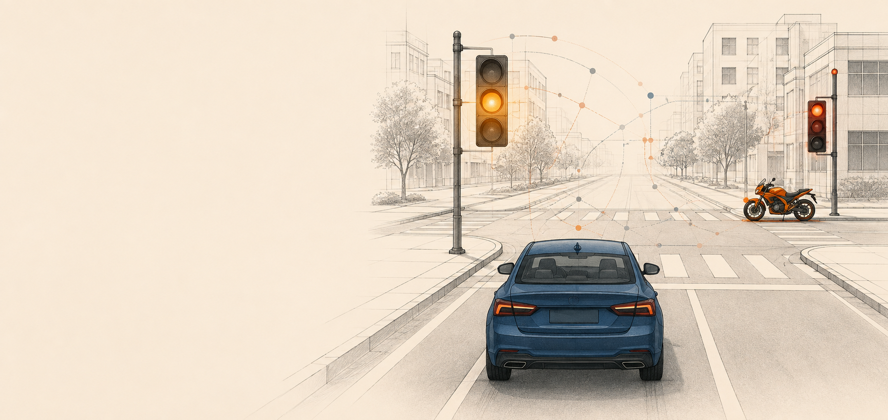
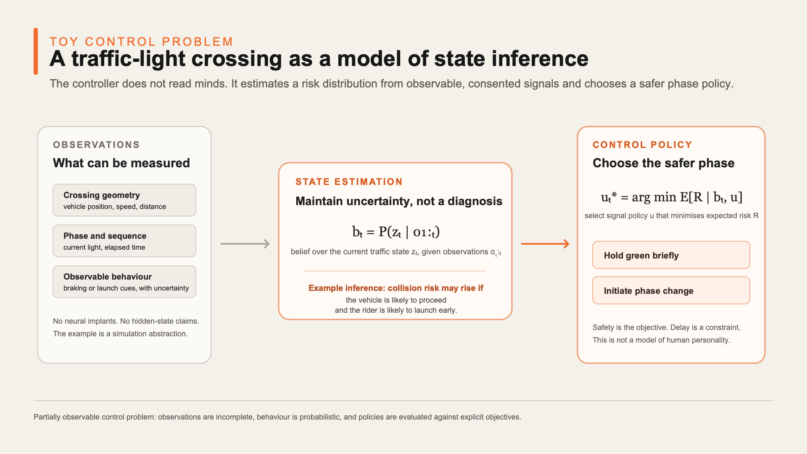
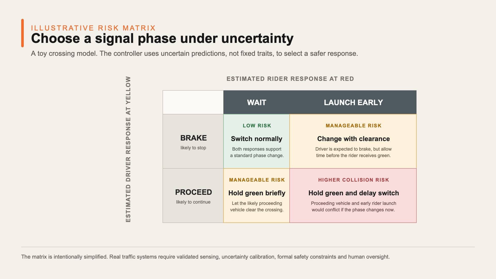
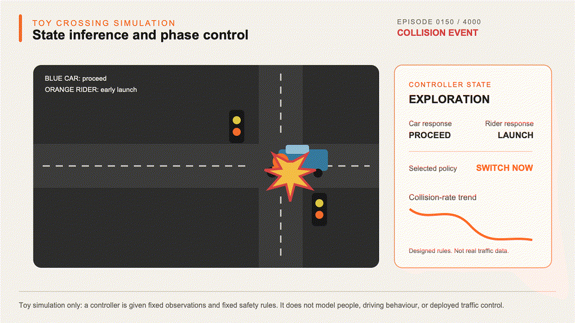
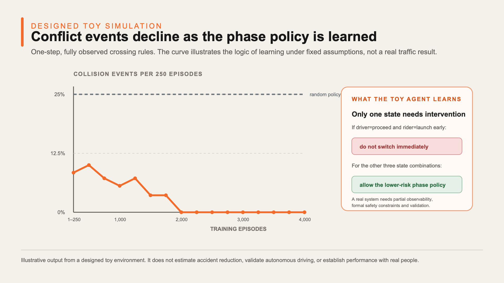

# The Traffic-Light Problem: Why Content Discovery Needs a State Model

*An illustrative state-inference problem: a car approaching an amber signal and a motorcycle held at red, with a crossing policy determined under uncertainty.*

A yellow traffic light is a small change in the environment. The decision it creates is not small. A driver may brake or proceed. A motorcyclist facing red may wait, or launch early. The safe phase policy depends on the evolving situation around both vehicles, not on either observed action alone.

This is the purpose of the traffic-light problem. It is not a claim about autonomous driving, human consciousness, or real-world accident prevention. It is a deliberately simple control problem that makes a general point about prediction: a record of prior actions is often insufficient for selecting the next action safely or usefully.

## From observation to a belief about state

In a partially observed system, an agent does not directly see every variable that matters. It receives observations, forms a belief about the current state, and chooses an action conditional on that belief. In compact form:

\[
b_t(z) = P(z_t \mid o_{1:t}), \qquad
u_t^* = \arg\min_u \mathbb{E}[R \mid b_t, u].
\]

Here, \(o_{1:t}\) is the available observation sequence, \(z_t\) is the unobserved state, \(b_t\) is the system's uncertainty-aware belief over that state, and \(u_t^*\) is the policy action selected to minimise a defined risk or loss \(R\).

For the toy crossing, the observations can include signal phase, vehicle location, speed, and simplified response tendencies. The latent state is not a diagnosis of either person. It is a narrow, operational representation of whether a switch is likely to be safe, risky, or unsafe under the assumptions built into the environment.

*Figure 1. A traffic-light crossing as a model of state inference. The graphic is illustrative and does not represent a deployed traffic-control system.*

## Why the interaction matters

The relevant decision cannot be recovered from the driver's history alone. It also cannot be recovered from the motorcyclist's history alone. The policy must account for the relationship between their possible responses at the present crossing.

| Car response at amber | Motorcycle response at red | Illustrative policy consequence |
| --- | --- | --- |
| Brake | Wait | Low risk: switch normally |
| Brake | Launch early | Manageable risk: add clearance |
| Proceed | Wait | Manageable risk: hold green briefly |
| Proceed | Launch early | Higher conflict risk: hold green and delay the switch |

*Figure 2. The interaction matrix used by the designed toy model. It is a fixed-rule simplification, not behavioural evidence about drivers or riders.*

The physical-world analogy should be treated carefully. Human action arises from distributed perceptual, motor, motivational and social processes. It is not the output of a single identifiable "traffic-light function". Research on action selection and decision-making supports the idea that behaviour depends on dynamic, distributed processes; it does not justify mind reading or certainty about private intention. The readiness-potential literature, in particular, remains contested and should not be read as proof that conscious intention is absent or irrelevant.

## A designed toy simulation

The accompanying simulation uses fully specified, deterministic rules. It begins with exploratory choices and iterates toward the safe policy available under those rules. It is useful as a visualisation of state inference and policy learning. It does **not** use real traffic data, test autonomous driving, estimate accident reduction, or establish performance with people.

*Toy simulation of state inference and phase control under fixed rules. It is an illustrative control model, not real traffic data or a deployed system.*

[Download the MP4 version of the simulation](assets/traffic-light-state-model/toy-crossing-simulation.mp4).

Under this deterministic and fully observed toy environment, conflict events decline as the specified controller converges to its fixed-rule solution.

*Figure 3. Conflict events decline as the fixed-rule phase policy is learned in the designed toy environment. This does not estimate accident reduction, validate autonomous driving, or establish performance with real people.*

## Why this matters for content discovery

Digital discovery has the same structural problem, although its consequences are different. A view, click, vote or search can be evidence of affinity. It can also reflect curiosity, disagreement, research, habit, surprise or a short-lived need. Treating an observed action as a complete explanation can make a system prematurely certain about what to show next.

The World Engine hypothesis proposes that discovery systems should maintain an explicit representation of evolving context and uncertainty. At a decision point, the question is not only, "What content resembles previous consumption?" It is also, "What state is plausibly active now, what transition could a candidate produce, and what uncertainty remains?"

This is not a claim that a system can know a person's inner state, access biological signals, or replicate the brain. The relevant inputs are consented digital observations and the outcome remains a probabilistic policy decision. The scientific question is narrower and testable: does explicit transition structure add predictive or decision value beyond strong history, sequence, representation-learning and state-space baselines?

The answer requires prospective, controlled evaluation with real participants and appropriate safeguards for user agency, diversity, safety and consent. The current synthetic prototype demonstrates an executable research environment, not human performance. A conventional model should be preferred whenever it matches or exceeds the structured model in capacity-matched evaluation.

## Further reading

- Gallivan, J. P., Bowman, N. A., & Chapman, C. S. (2018). [Action selection and the interaction between action and perception](https://www.nature.com/articles/s41583-018-0045-9). *Nature Reviews Neuroscience*.
- Schurger, A., Hu, P. B., Pak, J., & Roskies, A. L. (2021). [What is the readiness potential?](https://pubmed.ncbi.nlm.nih.gov/33931306/) *Trends in Cognitive Sciences*.
- [World Engine research paper](https://doi.org/10.5281/zenodo.21932401)
- [Evaluation framework](evaluation-framework.md)

© 2026 Voopa Corp. This note and its illustrations are made available under the repository's stated licence.
